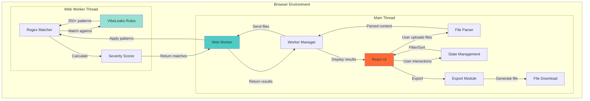
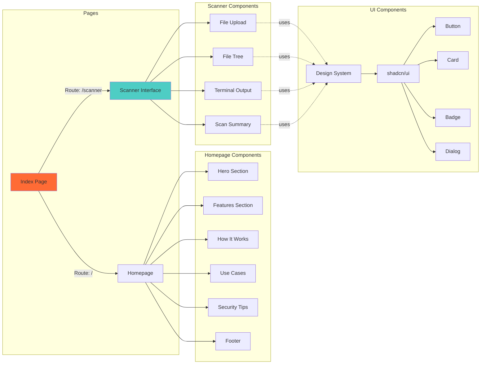
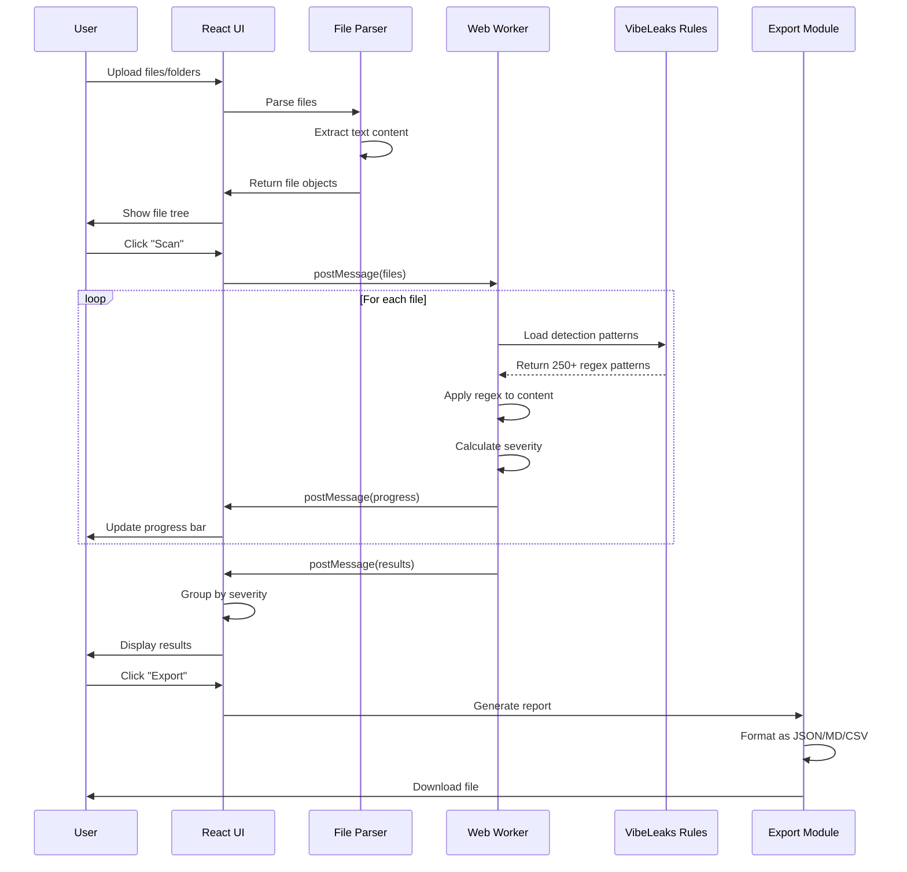
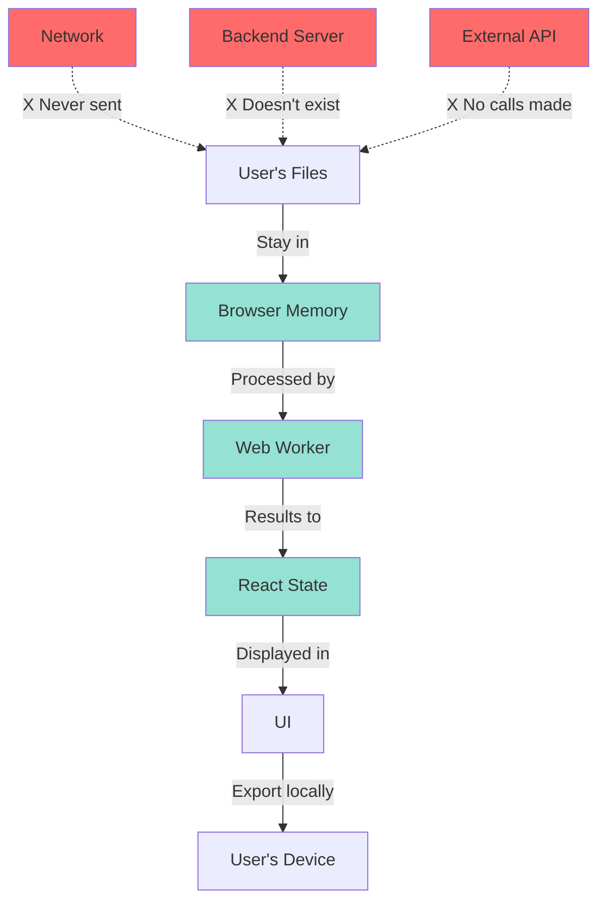
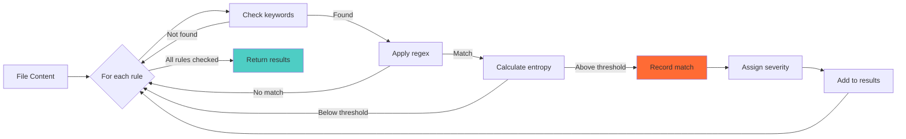

# 🏗️ VibeLeaks Architecture

## Overview

VibeLeaks is a **100% client-side** web application that performs secret scanning entirely in the browser using Web Workers for performance. No data ever leaves the user's machine.

---

## System Architecture



---

## Component Architecture



---

## Data Flow



---

## Technology Stack

### Frontend
- **Framework:** React 18.3.1
- **Language:** TypeScript 5.x
- **Build Tool:** Vite
- **Styling:** Tailwind CSS 3.x
- **UI Components:** shadcn/ui (Radix UI)
- **Icons:** Lucide React
- **Routing:** React Router v6

### Performance
- **Web Workers:** Offload heavy regex matching to background thread
- **Code Splitting:** Lazy load components for faster initial load
- **Tree Shaking:** Remove unused code during build

### Security & Privacy
- **No Backend:** 100% client-side processing
- **No Analytics:** No tracking or data collection
- **No Network Calls:** Files never leave the browser
- **Open Source:** Fully auditable code

### Detection Engine
- **Rules:** 250+ detection patterns
- **Pattern Matching:** JavaScript RegEx engine
- **Severity Scoring:** Based on impact and likelihood

---

## File Structure

```
vibeleaks/
├── src/
│   ├── components/
│   │   ├── homepage/          # Landing page sections
│   │   │   ├── HeroSection.tsx
│   │   │   ├── FeaturesSection.tsx
│   │   │   ├── HowItWorksSection.tsx
│   │   │   ├── UseCasesSection.tsx
│   │   │   ├── SecurityTipsSection.tsx
│   │   │   ├── StatsBar.tsx
│   │   │   └── Footer.tsx
│   │   ├── scanner/           # Scanner interface
│   │   │   ├── ScannerInterface.tsx
│   │   │   └── ScanSummaryCard.tsx
│   │   ├── ui/                # Reusable UI components (shadcn)
│   │   │   ├── button.tsx
│   │   │   ├── card.tsx
│   │   │   ├── badge.tsx
│   │   │   └── ...
│   │   ├── FileUpload.tsx     # Drag & drop file upload
│   │   ├── FileTree.tsx       # File explorer tree
│   │   ├── TerminalOutput.tsx # Results display
│   │   ├── Header.tsx         # Global header
│   │   └── ThemeToggle.tsx    # Dark/light mode
│   ├── config/
│   │   └── vibeleaks-rules.json # 250+ detection patterns
│   ├── workers/
│   │   └── scanner.worker.ts    # Web Worker scanning logic
│   ├── types/
│   │   └── scanner.ts           # TypeScript type definitions
│   ├── hooks/
│   │   ├── use-mobile.tsx       # Mobile detection hook
│   │   └── use-toast.ts         # Toast notifications
│   ├── pages/
│   │   ├── Index.tsx            # Homepage
│   │   └── NotFound.tsx         # 404 page
│   ├── lib/
│   │   └── utils.ts             # Utility functions
│   ├── App.tsx                  # Root component
│   ├── main.tsx                 # Entry point
│   └── index.css                # Global styles + design tokens
├── public/
│   ├── favicon.ico
│   └── public/
│       └── hero-pattern.png     # Hero background
├── .github/
│   └── ISSUE_TEMPLATE/          # Issue templates
│       ├── bug_report.yml
│       ├── feature_request.yml
│       └── detection_rule.yml
├── README.md
├── CONTRIBUTING.md
├── CODE_OF_CONDUCT.md
├── LICENSE
└── package.json
```

---

## Security Design

### Privacy-First Architecture



### No Data Transmission
- ✅ Files are read using `FileReader` API (client-side)
- ✅ Scanning happens in Web Worker (still client-side)
- ✅ Results stored in React state (browser memory)
- ✅ Exports use `Blob` and `URL.createObjectURL` (local file)
- ❌ No `fetch()` or `XMLHttpRequest` calls
- ❌ No server-side processing
- ❌ No database storage
- ❌ No analytics/tracking

---

## Performance Optimizations

### Web Workers
- **Problem:** Scanning large files with 140+ regex patterns blocks UI
- **Solution:** Offload scanning to background thread
- **Result:** UI stays responsive during scans

### Lazy Loading
- **Problem:** Large initial bundle size
- **Solution:** Code-split and lazy load scanner components
- **Result:** Faster time to interactive

### Virtual Scrolling (Future)
- **Problem:** Displaying 1000+ matches lags UI
- **Solution:** Virtualize long lists
- **Status:** Planned for v1.1

---

## Detection Engine

### Pattern Matching Flow



### Severity Calculation
- **Critical:** Full account access (AWS keys, database credentials)
- **High:** Significant access (API keys with write permissions)
- **Medium:** Limited access (read-only tokens)
- **Low:** Minimal risk (public identifiers)

---

## Export Formats

### JSON
```json
{
  "scanDate": "2025-01-15T10:30:00Z",
  "filesScanned": 42,
  "totalMatches": 7,
  "matches": [
    {
      "file": "config.js",
      "line": 15,
      "match": "ghp_***",
      "ruleId": "github-pat",
      "severity": "critical"
    }
  ]
}
```

### Markdown
```markdown
# VibeLeaks Scan Report

**Scan Date:** 2025-01-15 10:30:00
**Files Scanned:** 42
**Total Matches:** 7

## Critical Findings (2)
- `config.js:15` - GitHub Personal Access Token
- `env.local:8` - AWS Secret Key
```

### CSV
```csv
File,Line,Rule,Severity,Match
config.js,15,github-pat,critical,ghp_***
env.local,8,aws-secret-key,critical,AKIA***
```

---

## Browser Compatibility

| Browser | Version | Support |
|---------|---------|---------|
| Chrome | 90+ | ✅ Full |
| Firefox | 88+ | ✅ Full |
| Safari | 14+ | ✅ Full |
| Edge | 90+ | ✅ Full |
| Mobile | N/A | ⚠️ Limited (file upload restrictions) |

**Requirements:**
- Web Workers API
- FileReader API
- ES2020 support
- 2GB+ RAM (for large projects)

---

## Future Architecture Plans

### v1.1 - Enhanced Detection
- Add entropy-based detection for unknown secrets
- Implement ML-based false positive reduction
- Support custom rule files

### v1.2 - Developer Tools
- VS Code extension
- CLI version for CI/CD
- GitHub Action integration

### v2.0 - Platform Expansion
- Browser extension (Chrome/Firefox)
- Real-time code editor integration
- API for programmatic access

---

## Contributing to Architecture

See [CONTRIBUTING.md](CONTRIBUTING.md) for:
- Code style guidelines
- Adding new detection rules
- Performance optimization tips
- Testing strategies

---

**Questions about the architecture?** Open a [discussion](../../discussions)!
