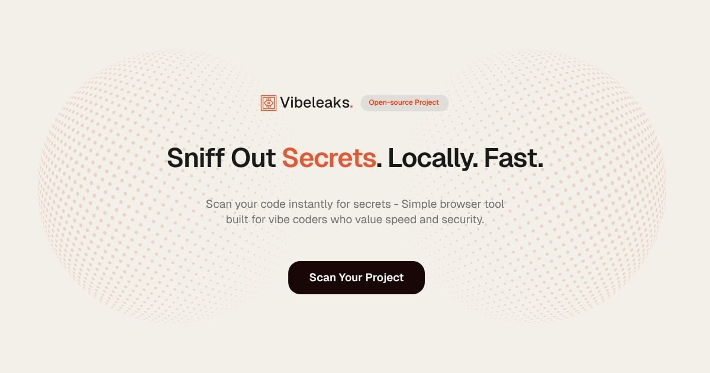

# 🔐 VibeLeaks - Client-Side Secret Scanner

[](https://choosealicense.com/licenses/mit/)
[](https://reactjs.org/)
[](https://www.typescriptlang.org/)
[](https://tailwindcss.com/)

> **Browser-based secret scanner that runs 100% locally. Detect hardcoded API keys, tokens, and credentials in your code without sending data anywhere.**



## 🚀 Why VibeLeaks?

- **🔒 100% Private**: All scanning happens in your browser - your code never leaves your machine
- **⚡ Lightning Fast**: Built with Web Workers for non-blocking, parallel scanning
- **🎯 Accurate Detection**: Uses proven patterns to detect 250+ secret types
- **📁 Multi-File Support**: Scan individual files or entire project directories
- **🎨 Beautiful UI**: Modern, responsive design with dark mode support
- **📊 Detailed Reports**: Export results as JSON, Markdown, or CSV
- **🔧 Developer-Friendly**: No installation, no CLI, just open and scan

## ✨ Features

### Core Scanning
- ✅ Detect AWS keys, Google API keys, GitHub tokens, database credentials, and 250+ more secret types
- ✅ Real-time scanning with progress indicators
- ✅ Severity-based filtering (Critical, High, Medium, Low)
- ✅ File tree visualization showing which files contain secrets
- ✅ Syntax-highlighted code snippets showing exact leak locations

### Security & Privacy
- ✅ **No data transmission** - everything runs client-side
- ✅ **No backend** - pure frontend application
- ✅ **No tracking** - your code is your business
- ✅ Open-source and auditable

### User Experience
- ✅ Drag & drop file upload
- ✅ Paste code directly
- ✅ Filter results by severity
- ✅ Export reports in multiple formats
- ✅ Responsive design (desktop & tablet optimized)
- ✅ Dark/Light theme support
- ✅ Gorgeous WebGL background effects

### Supported Secret Types

<details>
<summary>Click to see all 250+ supported secret patterns</summary>

- AWS Access Keys & Secret Keys
- Google API Keys & OAuth tokens
- GitHub Personal Access Tokens
- Slack tokens & webhooks
- Stripe API keys
- Database connection strings (MySQL, PostgreSQL, MongoDB)
- Private SSH keys
- JWT tokens
- Azure credentials
- Heroku API keys
- Twilio credentials
- And 230+ more...

See [vibeleaks-rules.json](src/config/vibeleaks-rules.json) for the complete list.

</details>

## 🎯 Use Cases

- **Pre-commit checks**: Scan your code before committing to catch secrets
- **Security audits**: Review legacy codebases for hardcoded credentials
- **Learning tool**: Understand what patterns constitute security risks
- **Code reviews**: Quick verification during PR reviews
- **Open-source prep**: Clean your codebase before open-sourcing

## 🚦 Getting Started

### Online (Easiest)

Just visit **[vibeleaks.dev](https://vibeleaks.dev)** - no installation needed!

### Local Development

1. **Clone the repository**
   ```bash
   git clone https://github.com/nithinworks/vibeleaks.git
   cd vibeleaks
   ```

2. **Install dependencies**
   ```bash
   npm install
   ```

3. **Start development server**
   ```bash
   npm run dev
   ```

4. **Open your browser**
   ```
   http://localhost:5173
   ```

### Build for Production

```bash
npm run build
```

The production-ready files will be in the `dist/` directory.

## 🚀 Deploy to Vercel

### One-Click Deploy

[](https://vercel.com/new/clone?repository-url=https://github.com/nithinworks/vibeleaks)

### Manual Deployment

1. **Install Vercel CLI** (optional)
   ```bash
   npm install -g vercel
   ```

2. **Deploy**
   ```bash
   vercel
   ```

3. **Production Deploy**
   ```bash
   vercel --prod
   ```

### Environment Configuration

No environment variables needed! VibeLeaks runs entirely client-side.

The `vercel.json` configuration is already included for:
- ✅ SPA routing (all routes redirect to index.html)
- ✅ Asset caching (1 year cache for static assets)
- ✅ Security headers (CSP, XSS protection, etc.)

## 📖 Usage

### Quick Start

1. **Upload your code**
   - Drag & drop files/folders onto the upload area
   - Or paste code directly into the text area

2. **Start scanning**
   - Click "Scan for Secrets"
   - Watch real-time progress as files are analyzed

3. **Review results**
   - See all detected secrets grouped by severity
   - Click on matches to view file location and code context
   - Filter by severity level (Critical/High/Medium/Low)

4. **Export findings**
   - Download results as JSON for automation
   - Export as Markdown for documentation
   - Save as CSV for spreadsheet analysis

### Example: Scanning a Project

```bash
# Navigate to your project
cd my-project

# Zip it (or select folder in browser)
zip -r project.zip .

# Upload to VibeLeaks and scan
```

## 🏗️ Technical Architecture

```
┌─────────────────────────────────────────────────┐
│                   React App                     │
│  (Main Thread - UI & State Management)          │
└────────────┬────────────────────────────────────┘
             │
             │ postMessage()
             │
┌────────────▼────────────────────────────────────┐
│            Web Worker                           │
│  (Background Thread - Heavy Scanning Logic)     │
│                                                 │
│  • Parses files                                 │
│  • Applies regex patterns                       │
│  • Matches against Gitleaks rules               │
│  • Returns results                              │
└─────────────────────────────────────────────────┘
```

### Key Technologies

- **React 18** - UI framework
- **TypeScript** - Type safety
- **Vite** - Build tool & dev server
- **Tailwind CSS** - Styling
- **Web Workers** - Non-blocking scanning
- **Three.js** - WebGL background effects
- **250+ Detection Patterns** - Comprehensive secret detection

## 🛠️ Configuration

The scanner uses detection rule definitions from `src/config/vibeleaks-rules.json`. You can:

- Add custom rules
- Modify severity levels
- Adjust regex patterns
- Disable specific detectors

See [CONTRIBUTING.md](CONTRIBUTING.md) for details on adding new rules.

## 🤝 Contributing

We welcome contributions! Please see [CONTRIBUTING.md](CONTRIBUTING.md) for details on:

- How to report bugs
- How to suggest features
- Code style guidelines
- Pull request process

## 📋 Roadmap

### v1.1 - Enhanced Detection
- [ ] Add support for custom rule files
- [ ] Entropy-based detection for unknown secrets
- [ ] Machine learning-based false positive reduction

### v1.2 - Developer Experience
- [ ] VS Code extension
- [ ] CLI version for CI/CD integration
- [ ] GitHub Action
- [ ] Pre-commit hook template

### v1.3 - Advanced Features
- [ ] Secret rotation guidance
- [ ] Integration with secret management tools (1Password, Vault)
- [ ] Historical scan comparison
- [ ] Team collaboration features

### v2.0 - Platform Expansion
- [ ] Browser extension (Chrome/Firefox)
- [ ] Mobile responsive scanning
- [ ] Real-time code editor integration
- [ ] API for programmatic access

**Want to help?** Check [open issues](https://github.com/nithinworks/vibeleaks/issues) or suggest new features!

## 📄 License

This project is licensed under the MIT License - see the [LICENSE](LICENSE) file for details.

## 🙏 Acknowledgments

- **[Gitleaks](https://github.com/gitleaks/gitleaks)** - For the excellent secret detection rules
- **Security Community** - For ongoing research into secret detection patterns

## 📞 Support

- **Issues**: [GitHub Issues](https://github.com/nithinworks/vibeleaks/issues)
- **Discussions**: [GitHub Discussions](https://github.com/nithinworks/vibeleaks/discussions)
- **Website**: [vibeleaks.dev](https://vibeleaks.dev)

## ⚠️ Disclaimer

VibeLeaks is a detection tool and may produce false positives or miss certain patterns. Always:
- Review results manually
- Use in combination with other security practices
- Rotate any discovered secrets immediately
- Never commit secrets to version control

---

**Made with ❤️ by the open-source community**

If VibeLeaks helped secure your code, give us a ⭐ on GitHub!
